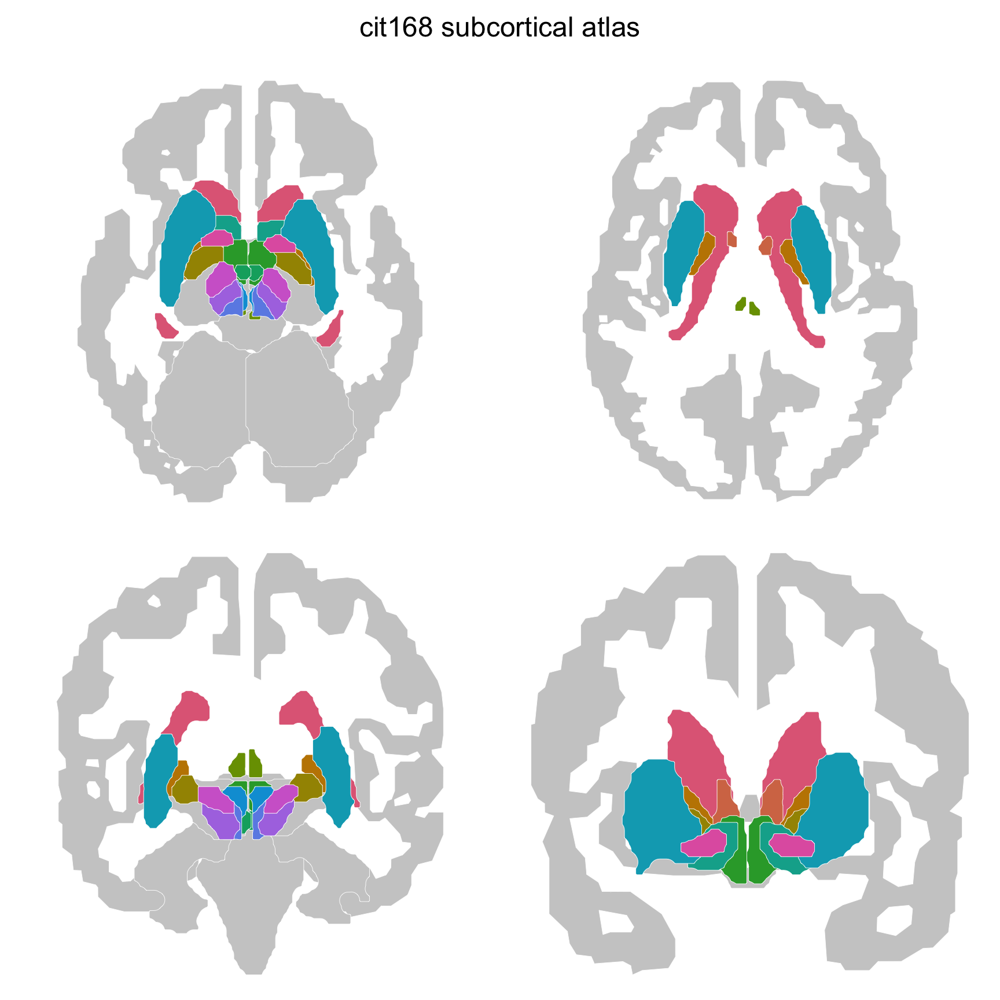

# ggsegCIT168

The CIT168 probabilistic subcortical atlas for the ggseg ecosystem.

Pauli and colleagues built CIT168 from high-resolution 7 Tesla Human
Connectome Project data. It gives 14 structures per hemisphere: the
striatum and pallidum alongside the small midbrain and diencephalic
nuclei that coarser atlases lump together as “ventral DC” — substantia
nigra (pars compacta and pars reticulata), red nucleus, subthalamic
nucleus, habenula and mammillary body.

Labels keep the abbreviations the published lookup table uses, so they
still match the source: `Pu_Left`, `SNc_PBP_VTA_Right`. The `region`
column is those stripped of the hemisphere and lower-cased (`pu`,
`snc pbp vta`), and a `name` column carries the spelled-out structure
name for printing.

## Atlas Citation

> Pauli WM, Nili AN, Tyszka JM (2018). “A high-resolution probabilistic
> in vivo atlas of human subcortical brain nuclei.” *Scientific Data*,
> 5, 180063. DOI:
> [10.1038/sdata.2018.63](https://doi.org/10.1038/sdata.2018.63)

If you use this atlas in your work, please cite both the original atlas
publication and the ggseg package:

> Mowinckel AM, Vidal-Pineiro D (2020). “Visualization of Brain
> Statistics With R Packages ggseg and ggseg3d.” *Advances in Methods
> and Practices in Psychological Science*, 3(4), 466-483. DOI:
> [10.1177/2515245920928009](https://doi.org/10.1177/2515245920928009)

## Installation

We recommend installing the ggseg-atlases through the ggsegverse
[r-universe](https://ggsegverse.r-universe.dev/#builds):

``` r

options(repos = c(
  ggsegverse = "https://ggsegverse.r-universe.dev",
  CRAN = "https://cloud.r-project.org"
))

install.packages("ggsegCIT168")
```

You can install this package from [GitHub](https://github.com/) with:

``` r

# install.packages("pak")
pak::pak("ggsegverse/ggsegCIT168")
```

## Usage

``` r

library(ggseg)
library(ggsegCIT168)

plot(cit168())
```



## Code of Conduct

Please note that the ggsegCIT168 project is released with a [Contributor
Code of
Conduct](https://contributor-covenant.org/version/2/1/CODE_OF_CONDUCT.html).
By contributing to this project, you agree to abide by its terms.
